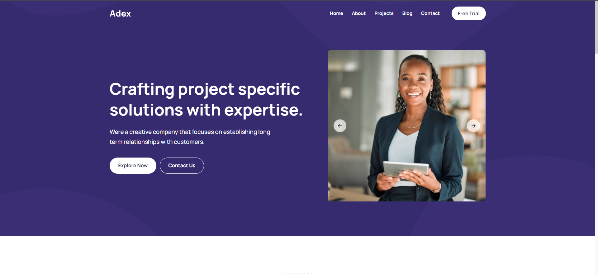
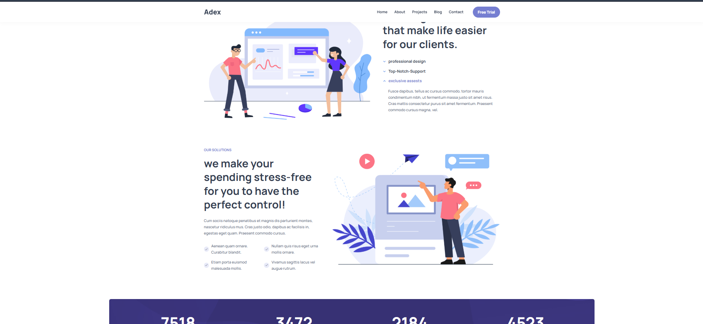
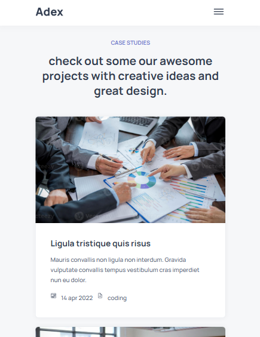
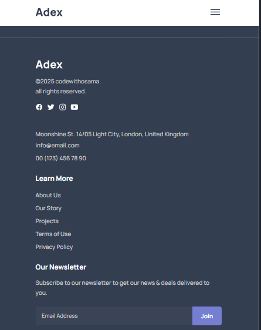

## ADEX – Business Website UI

## About

ADEX is a modern responsive business website designed to represent a professional brand with a clean and structured user interface.

This project focuses on building a real-world business landing page with sections like a hero banner, showcase image grid, and a fully responsive footer. It has been improved and refined to fix spacing issues, enhance responsiveness, and provide a smooth user experience across all screen sizes.

The goal of this project is to practice layout structuring, responsive design, and building visually appealing UI components using HTML, CSS, and JavaScript.

This project will continue to evolve with future UI enhancements and improvements.

## Features

Responsive navigation bar

Modern hero section

Showcase section with image cards

Responsive grid layout

Optimized mobile spacing and layout

Fully responsive footer

Social media icons with hover effects

Clean UI design

Smooth hover transitions

Mobile-first responsive improvements

Project Structure / Components

Navbar: Responsive top navigation
Hero Section: Main banner with branding
Showcase Section: Image-based content layout
Image Cards: Grid-based responsive display
Footer: Multi-column footer with links and contact section
Responsive CSS: Media queries for all screen sizes

## Screenshots

### Desktop View

### Mobile View

## Technologies Used

HTML5

CSS3

JavaScript (Vanilla JS)

Git & GitHub

Learning Outcome

Building a real-world business UI

Fixing responsive layout issues

Managing spacing and alignment problems

Working with flexbox and grid systems

Designing responsive image layouts

Creating a stable responsive footer

Improving mobile user experience

Deploying and managing projects using GitHub

## Live Preview

## Notes

This project focuses on frontend UI and layout design.

It is a learning-based business website project and does not include backend functionality.

The layout and responsiveness have been improved from the initial version to provide a better experience across devices.

Future updates may include animations, improved interactions, and additional UI sections.
